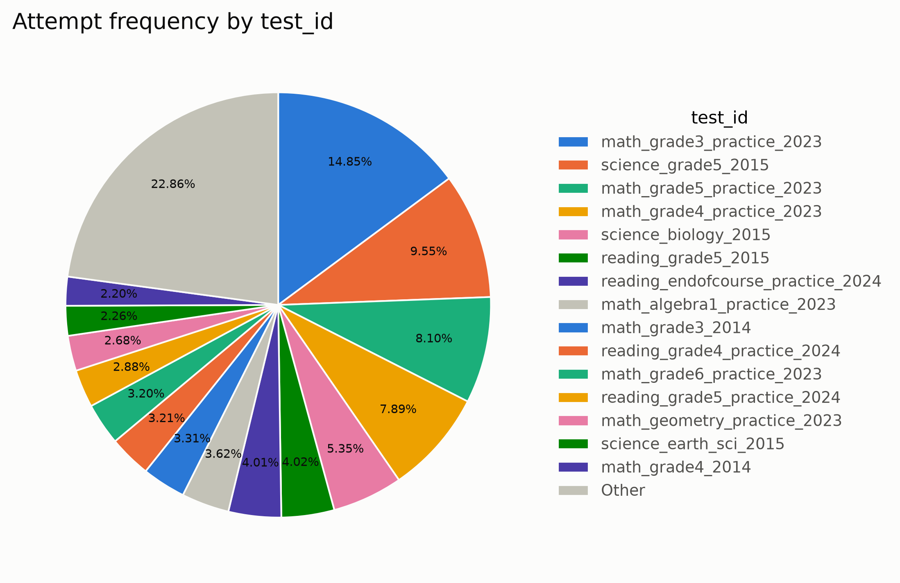
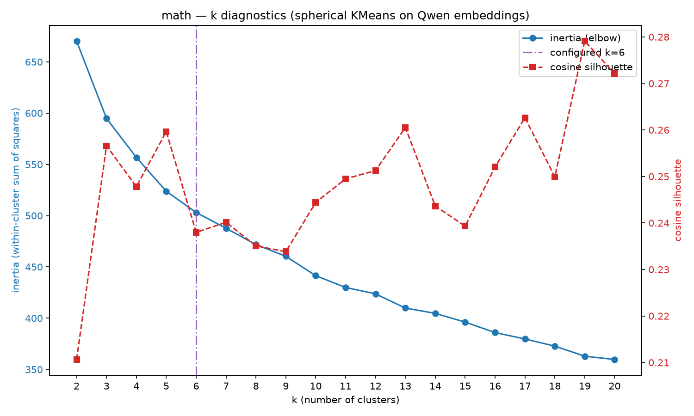
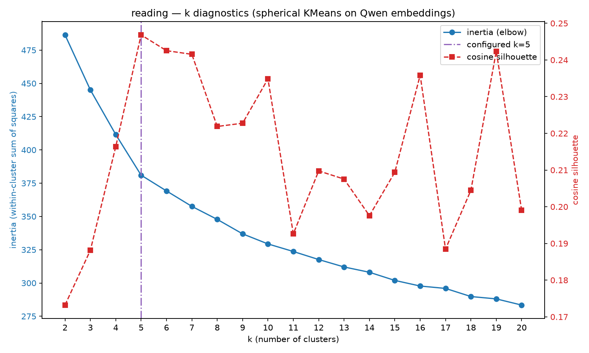
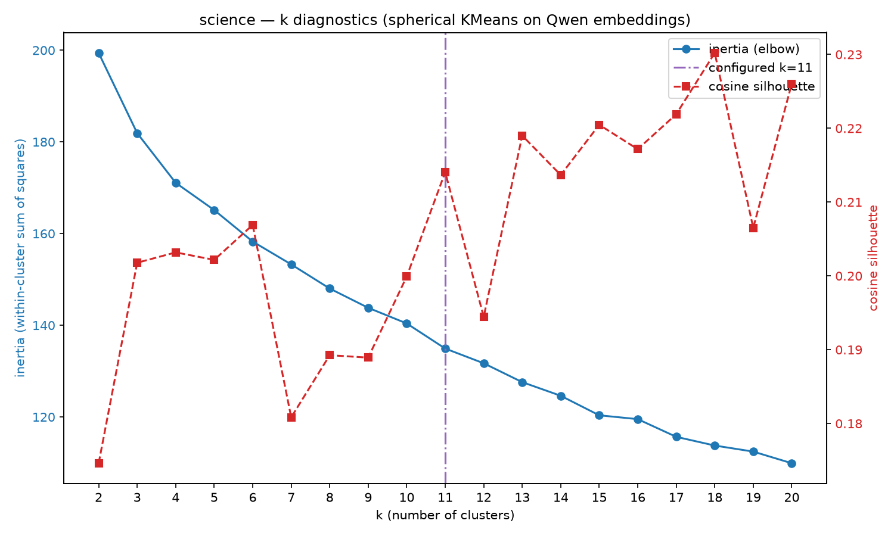
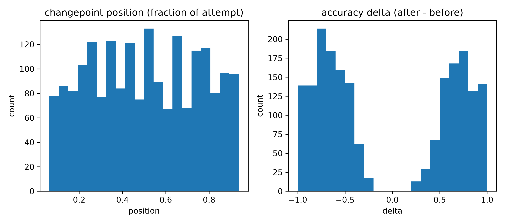

# SOLace Dataset
This repository contains the original data used for the IEEE BigData 2026 High School Symposium paper titled (title). 

## question_data
Contains .csv files for each subject (math, reading, science) with all of the questions and their matching test ID.

## user_data
Contains .csv files with the individual question responses (question_responses.csv) and the full completed test attempts (test_attempts.csv).

## embedding_outputs
Contains .csv outputs from scripts run during the text embedding phase of our research.

## markov_outputs
Contains .csv outputs from scripts run while making Markov chains using our data.

## Additional Figures (images)
Some helpful images, many of which not included natively in the original Latex paper:

