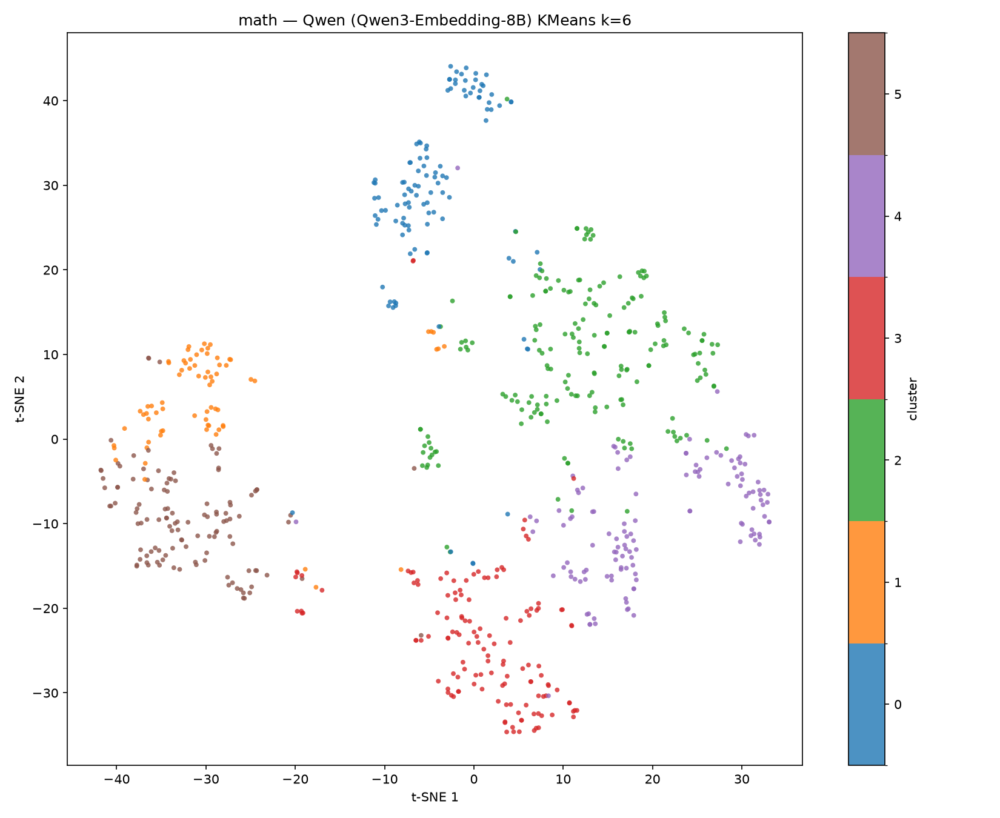
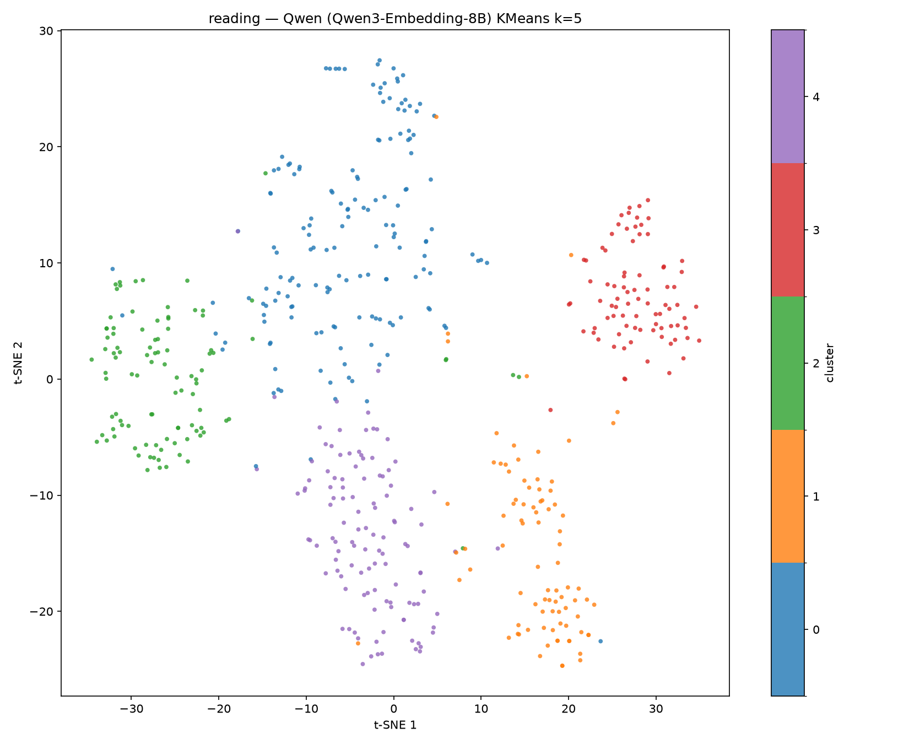
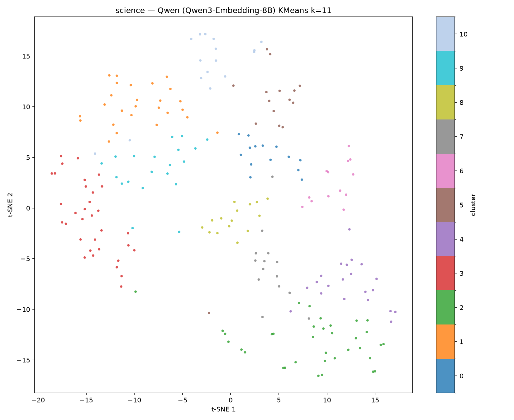

# SOLace Dataset
This repository contains the original data used for the IEEE BigData 2026 High School Symposium paper titled (title). 

## question_data
Contains .csv files for each subject (math, reading, science) with all of the questions and their matching test ID.

## user_data
Contains .csv files with the individual question responses (question_responses.csv) and the full completed test attempts (test_attempts.csv).

## Additional Figures
Some helpful images not included natively in the original Latex paper:

